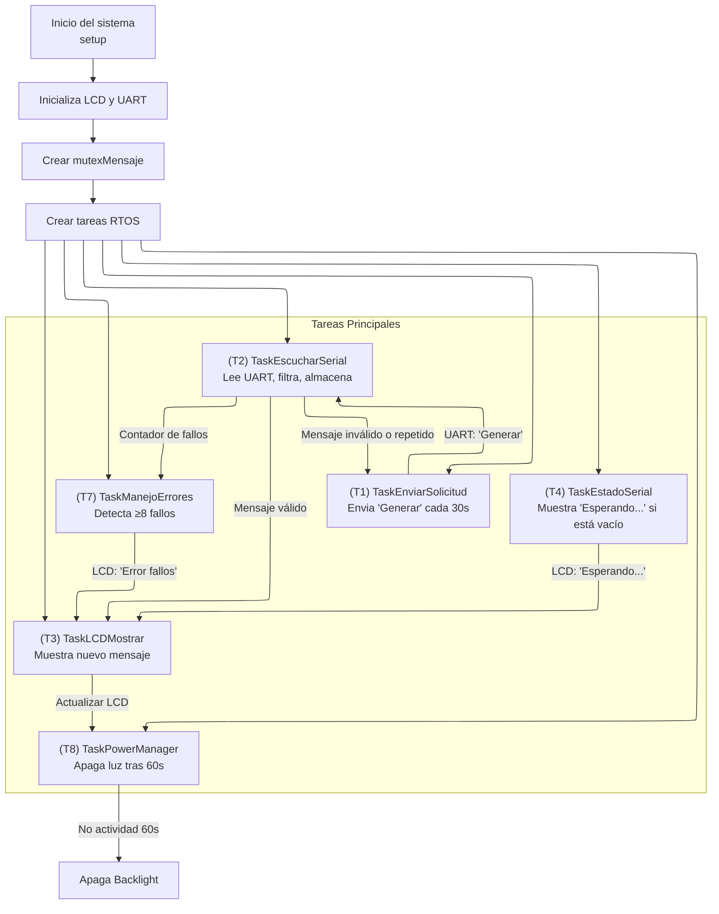

# 🧠 Asistente ciberfisico para recordatorios  
**Proyecto 3 - Taller de Sistemas Embebidos**  
Sistema de un Asistente ciberfísico para recordatorios a adultos mayores  

---

## 📖 Descripción 

Este proyecto consiste en el desarrollo de un **asistente ciberfísico embebido** capaz de mostrar **mensajes positivos y recordatorios útiles** para personas adultas mayores. El sistema se basa en una arquitectura distribuida que combina un **ESP32 ejecutando FreeRTOS**, una **pantalla LCD con modulo I2C** y un modelo de lenguaje **LLaMA 3 ejecutado localmente en una PC** mediante **Ollama**.

El sistema es capaz de generar mensajes como:
- `Eres amado`
- `Haz ejercicio`
- `Dios te cuida siempre`
- `Lee la biblia`
- `Ten paciencia`

---

## ⚙️ Herramientas utilizadas

- 🔌 **ESP32** (con FreeRTOS)
- 📟 **Pantalla LCD 16x2 I2C**
- 🧠 **LLaMA 3 (vía Ollama, local)**
- 🐍 **Python 3** (para comunicación serial y ejecución del modelo)
- 📡 **Comunicación Serial UART**
- 💻 **Arduino IDE**

---

## Sistema FreeRTOS 

En la implementación de sistema con FreeRTOS en el ESP32, se debe orquestar el comportamiento del sistema por medio de Tareas (Tasks), cada una de ellas  tendrán prioridades y funcionalidades distintas, como se muestra en la Tabla 1.

### Tabla 1: Tareas FreeRTOS en el ESP32

| Tarea | Nombre               | Descripción                                                                 |
|-------|----------------------|-----------------------------------------------------------------------------|
| T1    | TaskEnviarSolicitud  | Genera y envía una solicitud cada 30 segundos para iniciar comunicación.   |
| T2    | TaskEscucharSerial   | Escucha el UART, recibe mensajes y valida su contenido.                    |
| T3    | TaskLCDMostrar       | Muestra mensajes nuevos en la pantalla LCD 16x2.                           |
| T4    | TaskEstadoSerial     | Muestra el estado “Esperando...” cuando no hay mensajes disponibles.       |
| T5    | TaskHeartbeat        | Indicador de vida: genera una señal/parpadeo cada 15 segundos.             |
| T6    | TaskControlFlujo     | Tarea reservada orquestar la ejecución definiendo el tiempo de ejecución.  |
| T7    | TaskManejoErrores    | Detecta errores UART consecutivos y muestra advertencias.                  |
| T8    | TaskPowerManager     | Apaga el backlight del LCD tras 60 segundos sin nuevos mensajes.           |


De manera visual se muestra el Diagrama de flujo del sistema a continuación. 

### Diagrama de Flujo 


Es importante aclarar que las tareas `(T5) TaskHeartbeat` y la tarea `(T6) TaskControlFlujo`, son tareas que por su naturaleza están implicitas dentro del sistema, estas se ejecutan cada cierto tiempo y definen aspectos importantes en la trama, razón por la que no aparecen en el diagrama de flujo de manera explícita.  


## 🛠️ Tutorial de Instalación y Ejecución

Este proyecto permite generar mensajes amigables para personas adultas mayores usando un microcontrolador ESP32 y un modelo de lenguaje grande (LLM) ejecutado localmente. A continuación se describen los pasos necesarios para ponerlo en funcionamiento.

---

### 1. Configurar el modelo LLM con Ollama

#### 1.1 Instalar Ollama

Sigue las instrucciones oficiales en: [https://ollama.com/download](https://ollama.com/download)  
Una vez instalado, abre una terminal y ejecuta:

```bash
ollama run llama3
```
Esto descargará e inicializará el modelo `llama3` localmente, dejándolo listo para recibir prompts desde el ESP32 a través del servidor Flask.

### 2. Preparar el entorno de desarrollo en Arduino IDE
#### 2.1 Instalar dependencias
Asegúrate de tener instalada la biblioteca `LiquidCrystal_I2C` desde el Gestor de Bibliotecas de Arduino IDE.

Instala también el paquete de tarjetas `ESP32 by Espressif Systems` desde el Gestor de Tarjetas.

Selecciona la placa `DOIT ESP32 DEVKIT V1`.

#### 2.2 Configurar IDE
Abre Arduino IDE.

En el menú Herramientas, selecciona:

- Placa: DOIT ESP32 DEVKIT V1

- Puerto: selecciona el COM al que esté conectado el ESP32

### 3. Subir el código al ESP32
Abre el archivo `ciber_v4.ino` del proyecto en el directorio `Asistente_ciberfisico_recordatorios/esp32_codes
/ciber_v4/`.

Haz clic en `Verificar` para compilar.

Haz clic en `Subir` para cargar el código al ESP32.

Durante la carga, mantén presionado el botón `BOOT` del ESP32 hasta que inicie la transferencia.

### 4. Ejecutar el script de interfaz serial
Ejecutar `interfaz_serial.py` para iniciar la comunicación desde PC,.
>Este archivo se encuentra en el directorio `Asistente_ciberfisico_recordatorios/python_code`.

```bash
python interfaz_serial.py
```

### ✅ ¡Listo!
El sistema comenzará a funcionar automáticamente:

- El ESP32 enviará el comando "Generar" cada 30 segundos.

- El servidor local procesará el prompt con el modelo llama3.

- El ESP32 recibirá y validará el mensaje.

- El mensaje válido será mostrado en la pantalla LCD 16x2.

Si no hay mensajes válidos o ocurren errores, se mostrará "Esperando..." o mensajes de advertencia.
> Nota: El sistema es completamente autónomo, no requiere conexión a internet, y puede ser modificado fácilmente para otros casos de uso.

## Referencias

[1] Observatorio del Envejecimiento, Universidad de Costa Rica (UCR), *Primer Informe: Personas Adultas Mayores en Costa Rica*, 2023. [En línea]. Disponible en: [Primer Informe: Personas Adultas Mayores en Costa Rica ](https://fmedicina.ucr.ac.cr/wp-content/uploads/2025/06/1_PRIMER-INFORME_Envejecimiento.pdf)

[2] Instituto Nacional de Estadística y Censos (INEC), *Panorama Demográfico 2023*, San José, Costa Rica: INEC, 2023. Disponible en: [Panorama Demográfico 2023](https://admin.inec.cr/sites/default/files/2024-12/repoblacEV-Panorama%20demogr%C3%A1fico-2023A.pdf)

[3] Universidad Cenfotec, *Guía para conectar ESP32 a un servidor local con Ollama*, 2024. [En línea]. Disponible en: [Guía para conectar ESP32 a un servidor local con Ollama](https://github.com/Universidad-Cenfotec/ExpoCenfo/blob/main/Ejemplos_LLM_ESP32/ESP32_Ollama_Guide.md)


