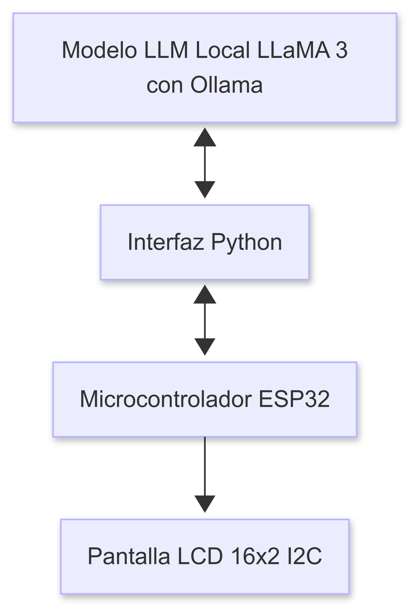
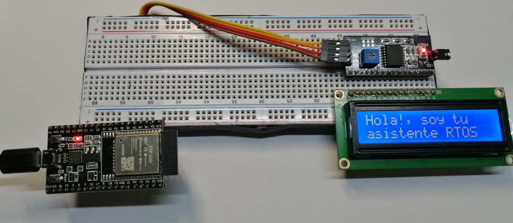

# 🧠 Asistente ciberfisico para recordatorios  
**Proyecto 3 - Taller de Sistemas Embebidos**  
Sistema de un Asistente ciberfísico para recordatorios a adultos mayores  

---

## 📖 Descripción 

Este proyecto consiste en el desarrollo de un **asistente ciberfísico embebido** capaz de mostrar **mensajes positivos y recordatorios útiles** para personas adultas mayores. El sistema se basa en una arquitectura distribuida que combina un **ESP32 ejecutando FreeRTOS**, una **pantalla LCD con modulo I2C** y un modelo de lenguaje **LLaMA 3 ejecutado localmente en una PC** mediante **Ollama**.

El sistema es capaz de generar mensajes como:
- `Eres amado`
- `Haz ejercicio`
- `Dios te cuida siempre`
- `Lee la biblia`
- `Ten paciencia`

---

## 📚 Índice

- [⚙️ Herramientas utilizadas](#️-herramientas-utilizadas)
- [📋 Sistema FreeRTOS](#-sistema-freertos)
- [📁 Estructura del Proyecto](#-estructura-del-proyecto)
- [🛠️Tutorial](#-tutorial)
- [⚠️ Errores y Consideraciones](#️-errores-y-consideraciones)
- [✅ Conclusiones](#-conclusiones)
- [⚙️ Prototipo](#-prototipo)
- [📚 Referencias](#referencias)


---


## ⚙️ Herramientas utilizadas

- 🔌 **ESP32** (con FreeRTOS)
- 📟 **Pantalla LCD 16x2 I2C**
- 🧠 **LLaMA 3 (vía Ollama, local)**
- 🐍 **Python 3** (para comunicación serial y ejecución del modelo)
- 📡 **Comunicación Serial UART**
- 💻 **Arduino IDE**


La arquitectura del sistema se muestra en la siguiente imagen.

<p align="center">
  
</p>

---


## 📋 Sistema FreeRTOS 

En la implementación de sistema con FreeRTOS en el ESP32, se debe orquestar el comportamiento del sistema por medio de Tareas (Tasks), cada una de ellas  tendrán prioridades y funcionalidades distintas, como se muestra en la Tabla 1.

### Tabla 1: Tareas FreeRTOS en el ESP32

| Tarea | Nombre               | Descripción                                                                 |
|-------|----------------------|-----------------------------------------------------------------------------|
| T1    | TaskEnviarSolicitud  | Genera y envía una solicitud cada 30 segundos para iniciar comunicación.   |
| T2    | TaskEscucharSerial   | Escucha el UART, recibe mensajes y valida su contenido.                    |
| T3    | TaskLCDMostrar       | Muestra mensajes nuevos en la pantalla LCD 16x2.                           |
| T4    | TaskEstadoSerial     | Muestra el estado “Esperando...” cuando no hay mensajes disponibles.       |
| T5    | TaskHeartbeat        | Indicador de vida: genera una señal/parpadeo cada 15 segundos.             |
| T6    | TaskControlFlujo     | Tarea reservada orquestar la ejecución definiendo el tiempo de ejecución.  |
| T7    | TaskManejoErrores    | Detecta errores UART consecutivos y muestra advertencias.                  |
| T8    | TaskPowerManager     | Apaga el backlight del LCD tras 60 segundos sin nuevos mensajes.           |


De manera visual se muestra el Diagrama de flujo del sistema a continuación. 

### Diagrama de Flujo 


Es importante aclarar que las tareas `(T5) TaskHeartbeat` y la tarea `(T6) TaskControlFlujo`, son tareas que por su naturaleza están implicitas dentro del sistema, estas se ejecutan cada cierto tiempo y definen aspectos importantes en la trama, razón por la que no aparecen en el diagrama de flujo de manera explícita.  

---

## 📁 Estructura del Proyecto

```plaintext
Asistente_ciberfisico_recordatorios/
├── README.md                    # Documento principal con descripción y tutorial del proyecto
├── esp32_codes/                 # Código fuente para el microcontrolador ESP32
│   ├── esp32_specs.ino          # Especificaciones iniciales o prototipo alternativo
│   └── ciber_v4/                # Versión principal del código RTOS
│       └── ciber_v4.ino         # Implementación de tareas con FreeRTOS en el ESP32
├── img/                         # Imagenes del repositorio                     
└── python_code/                 # Código en Python para pruebas o interfaz de comunicación
    └── interfaz_serial.py       # Script que permite enviar prompts al servidor desde la PC

```
---

## 🛠️ Tutorial

Este proyecto permite generar mensajes amigables para personas adultas mayores usando un microcontrolador ESP32 y un modelo de lenguaje grande (LLM) ejecutado localmente. A continuación se describen los pasos necesarios para ponerlo en funcionamiento.


### 🟢 1. Configurar el modelo LLM con Ollama

#### 1.1 Instalar Ollama

Sigue las instrucciones oficiales en: [https://ollama.com/download](https://ollama.com/download)  
Una vez instalado, abre una terminal y ejecuta:

```bash
ollama run llama3
```
Esto descargará e inicializará el modelo `llama3` localmente, dejándolo listo para recibir prompts desde el ESP32 a través del servidor Flask.

### 🟢 2. Preparar el entorno de desarrollo en Arduino IDE
#### 2.1 Instalar dependencias
Asegúrate de tener instalada la biblioteca `LiquidCrystal_I2C` desde el Gestor de Bibliotecas de Arduino IDE.

Instala también el paquete de tarjetas `ESP32 by Espressif Systems` desde el Gestor de Tarjetas.

Selecciona la placa `DOIT ESP32 DEVKIT V1`.

#### 2.2 Configurar IDE
Abre Arduino IDE.

En el menú Herramientas, selecciona:

- Placa: DOIT ESP32 DEVKIT V1

- Puerto: selecciona el COM al que esté conectado el ESP32

### 🟢 3. Subir el código al ESP32
Abre el archivo `ciber_v4.ino` del proyecto en el directorio `Asistente_ciberfisico_recordatorios/esp32_codes
/ciber_v4/`.

Haz clic en `Verificar` para compilar.

Haz clic en `Subir` para cargar el código al ESP32.

Durante la carga, mantén presionado el botón `BOOT` del ESP32 hasta que inicie la transferencia.

### 🟢 4. Ejecutar el script de interfaz serial
Ejecutar `interfaz_serial.py` para iniciar la comunicación desde PC,.
>Este archivo se encuentra en el directorio `Asistente_ciberfisico_recordatorios/python_code`.

```bash
python interfaz_serial.py
```

### ✅ 5. ¡Listo!
El sistema comenzará a funcionar automáticamente:

- El ESP32 enviará el comando "Generar" cada 30 segundos.

- El servidor local procesará el prompt con el modelo llama3.

- El ESP32 recibirá y validará el mensaje.

- El mensaje válido será mostrado en la pantalla LCD 16x2.

Si no hay mensajes válidos o ocurren errores, se mostrará "Esperando..." o mensajes de advertencia.
> Nota: El sistema es completamente autónomo, no requiere conexión a internet, y puede ser modificado fácilmente para otros casos de uso.

---

## ⚠️ Errores y Consideraciones

Durante el desarrollo del sistema no se presentaron errores críticos en la ejecución del código ni en el funcionamiento del microcontrolador con FreeRTOS. Sin embargo, se identificaron problemas importantes relacionados con la selección del  modelo de lenguaje (LLM) utilizado.

### 🔍 Elección del modelo LLM

Algunos modelos locales disponibles en Ollama **no funcionaron adecuadamente** para esta aplicación. En particular:

- ❌ `deepseek-r1:1.5b`  
- ❌ `deepseek-r1:8b`  
- ❌ `phi:latest`

Estos modelos presentaron fallos o respuestas inestables, como:

- Salidas incompletas o que no respetaban el formato solicitado.
- Errores de traducción del inglés al español.
- Tiempos de respuesta demasiado largos.

- ✅ En cambio, el modelo funcionó `llama3:latest` correctamente:
> Este modelo entregó respuestas claras, coherentes y adecuadas para ser procesadas por el ESP32.

### ✅ Recomendación
 ⚠️ **Antes de integrar un modelo LLM local al sistema, recomiendo probarlo antes manualmente con prompts de ejemplo.**  
> Esto ayudará a validar que su comportamiento sea estable y que las respuestas sean compatibles con los filtros del microcontrolador.

Es importante siempre Tener en cuenta:
- El tamaño del modelo (para evitar sobrecargar el sistema).
- La claridad del texto generado.
- La estabilidad en múltiples ejecuciones.


#### Ejemplo de promt utilizado para adecuar y formatear las respuestas del modelo.

```plaintext
Actúa como un asistente virtual RTOS que corre en un ESP32. 
Genera un mensaje corto (máximo 32 caracteres) para adultos mayores. 
El mensaje puede ser un recordatorio útil o una frase positiva. 
No repitas el último mensaje (el sistema lo controla).

Ejemplos:
- Usa los lentes para leer  
- Dios te cuida   
- Descansa un rato  
- Cierra bien la puerta  
- Te amo mucho, mamá
- Te amo mucho, papá


Cuando diga "Generar", responde con un solo mensaje. Sin explicaciones, solo el texto.

Esperando comando: "Generar"

```
---
## ✅ Conclusiones

- 🧠 **La integración de un modelo de lenguaje local con un sistema embebido** como el ESP32 permite generar interacciones útiles sin necesidad de conexión a internet, favoreciendo la autonomía del dispositivo.

- 🧓 **Este proyecto demuestra una aplicación práctica de inteligencia artificial para el bienestar de adultos mayores**, generando mensajes de acompañamiento breves y amigables de forma automática.

- ⚙️ **El uso de FreeRTOS fue fundamental** para manejar tareas concurrentes como la comunicación UART, el manejo de pantalla LCD, y la supervisión de errores, manteniendo el sistema estable y reactivo.

- 🧪 **La elección del modelo LLM es clave**. No todos los modelos disponibles son adecuados para este tipo de aplicaciones; algunos pueden fallar o generar salidas inservibles. Se recomienda probarlos previamente antes de la integración final.

- 💡 **El enfoque ciberfísico aplicado aquí puede escalarse** para otras aplicaciones similares que requieran comunicación autónoma, generación de contenido local, o interacción sin conexión con el usuario final.

- 🎉 Este proyecto representa una combinación de tecnologías modernas (LLM + RTOS + UART) para resolver una necesidad.

---

## ⚙️ Prototipo

El prototipo del sistema se muestra en la siguiente figura.




## Referencias

[1] Observatorio del Envejecimiento, Universidad de Costa Rica (UCR), *Primer Informe: Personas Adultas Mayores en Costa Rica*, 2023. [En línea]. Disponible en: [Primer Informe: Personas Adultas Mayores en Costa Rica ](https://fmedicina.ucr.ac.cr/wp-content/uploads/2025/06/1_PRIMER-INFORME_Envejecimiento.pdf)

[2] Instituto Nacional de Estadística y Censos (INEC), *Panorama Demográfico 2023*, San José, Costa Rica: INEC, 2023. Disponible en: [Panorama Demográfico 2023](https://admin.inec.cr/sites/default/files/2024-12/repoblacEV-Panorama%20demogr%C3%A1fico-2023A.pdf)

[3] Universidad Cenfotec, *Guía para conectar ESP32 a un servidor local con Ollama*, 2024. [En línea]. Disponible en: [Guía para conectar ESP32 a un servidor local con Ollama](https://github.com/Universidad-Cenfotec/ExpoCenfo/blob/main/Ejemplos_LLM_ESP32/ESP32_Ollama_Guide.md)


